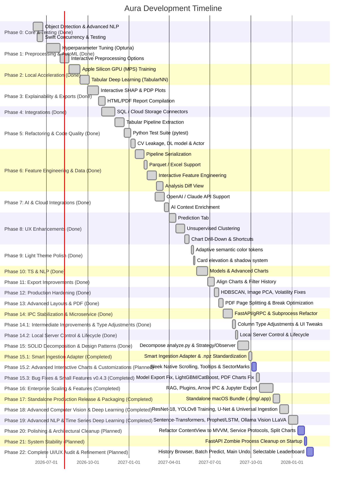

# 🗺️ Aura macOS App: Future Development Roadmap (Version 2.0)

This roadmap outlines key enhancements, new features, and technical optimizations planned for subsequent versions of the **Aura** data analysis platform.

---

## 📅 Roadmap Overview: Twenty-Two Implementation Phases



---

## 🛠️ Detailed Feature Breakdown

### Phase 0: Core Pipelines & Testing (Completed)

Foundation features and recent feature additions that are fully implemented, verified, and merged.

* **Object Detection Pipeline (YOLO & VOC)**:
  * Detect and parse `dataset.yaml` for YOLO structure and Pascal VOC `.xml` annotations recursively.
  * Extract bounding boxes, calculate statistics (counts per split, sizes, spatial center densities).
  * Crop images by annotations to run a Pixel Crop Classifier (Logistic Regression & Random Forest) yielding ML metrics.
  * Draw bounding boxes on preview images.
* **Advanced NLP Pipeline**:
  * Implement Bigram & Trigram extraction with TF-IDF weight scores.
  * Compute vocabulary metrics (TTR, unique counts) and rule-based sentiment distributions.
  * Correlate text feature lengths and sentiment scores against target columns.
* **Smart Prompt Summarization & Sampling**:
  * O(1) correlation matrix cached calculations.
  * Calculate global min, max, mean, and median for numeric X/Y axes in `buildChartPrompt`.
  * Group and summarize categorical X distribution and Series groups.
  * Perform evenly-spaced representative sampling of up to 100 points, sorted by X-value ascending, to capture dataset boundaries and density correctly.
* **Concurrency & Test Coverage**:
  * Swift Data async loading and background thread execution to prevent main thread blocking.
  * Strict Swift 6 concurrency safety checks.
  * Integrated modern `Swift Testing` library, establishing a test suite (`AuraTests/`) covering format detection, runner path resolution, thread safety, and prompt building.

### Phase 1: AutoML Optimizations & Interactive Data Preprocessing (Completed)

Enhance the preprocessing controls and modeling accuracy so the app transitions from a data profiling MVP to a production-ready model builder.

* **Optuna Hyperparameter Tuning**:
  * Replace the static Random Forest / XGBoost presets with automated hyperparameter tuning.
  * Integrate `optuna` in the Python subprocess to search for optimal estimators, max depth, learning rates, and feature thresholds under a 10-second search budget.
  * Render a search path visualization in the dashboard (tuning trials).
* **Interactive Data Cleaning Panel**:
  * Add a dedicated SwiftUI view to let users select cleaning actions from suggestions:
    * **Outliers**: Cap with IQR, drop outliers, or flag using Isolation Forests.
    * **Imputation**: Switch between Median, Mean, Mode, KNN, or Iterative (MICE) imputation.
    * **Encoding**: Select between One-Hot Encoding and Target Encoding (for high-cardinality columns).

### Phase 2: Local Acceleration & Tabular Deep Learning (Completed)

Leverage Apple Silicon hardware capabilities to train complex models locally.

* **MPS (Metal Performance Shaders) GPU Training**:
  * Updated `PythonRunner` environment to verify Apple Silicon GPU support.
  * Enabled MPS acceleration in PyTorch pipelines for local deep learning.
* **Deep Learning for Tabular Data**:
  * Integrated a custom, lightweight PyTorch-based neural network architecture (`TabularNN`) for tabular data using LayerNorm and residual connections.
  * Trained and compared deep learning performance side-by-side with classical trees (XGBoost/Random Forests) on Apple Silicon GPUs.

### Phase 3: Visual Explainability & Advanced Reporting (Completed)

Expand explainability dashboards and exportable summaries for analysts and stakeholders.

* **Interactive Explainability Dashboards**:
  * Render interactive SHAP summary plots (beeswarm plots) directly in the UI.
  * Integrate Partial Dependence Plots (PDP) and Individual Conditional Expectation (ICE) curves to show how model predictions vary with changes to specific features.
* **Rich Document Compiler**:
  * Allow exporting the analysis history, modeling metrics, SHAP importances, and Ollama narrative reviews into a styled PDF or self-contained HTML report (embedded with interactive charts using lightweight charting libraries like ECharts).
  * Fix PDF layout page-splitting bounds to strictly divide content on A4 margins, enforce vertical layout wrapping for two-column grids, and dynamically override contrast colors for light paper outputs.
  * Embed heat-mapped Confusion Matrices (Test and Validation sets) and a full 15x15 Pearson Feature Correlation Matrix Heatmap directly inside both exported Markdown and HTML/PDF documents.

### Phase 4: Enterprise Data Connectors & Schedulers (Completed)

Enable direct database ingestion and automated scheduling.

* **Direct DB Connectors**:
  * Allow importing datasets directly from local SQLite databases or remote database servers (PostgreSQL, MySQL, Google BigQuery).
  * Securely store connection strings and database passwords in the macOS Keychain.
* **Analysis Schedulers**:
  * Add a cron-like scheduler to run analyses and export reports periodically (e.g., daily tracking of time series sales data), with macOS notifications on completion.

### Phase 5: Refactoring & Code Quality (Completed)

Address structural technical debt identified in the code review. Refactored the core engine, updated Swift execution safety, and added automated test verification.

* **Stateful Cleaner Relocation**:
  * Moved `StatefulCleaner` from `analyze.py` into [cleaning.py](file:///Users/oleksiichumak/Developer/Xcode.projects/Aura/Aura/utils/cleaning.py) to enable independent unit testing and clean state management.
* **Modular Tabular Pipeline**:
  * Extracted the 1,500-line tabular engine into [tabular.py](file:///Users/oleksiichumak/Developer/Xcode.projects/Aura/Aura/pipelines/tabular.py).
  * Split into focused stages: `preprocess()`, `train_models()`, `compute_metrics()`, and `build_charts()`.
  * Restructured `analyze.py` to act as a slim ~100-line CLI router.
* **Data Leakage & Deep Learning Model References**:
  * Fixed CV Data Leakage by executing preprocessing fold-by-fold inside cross-validation.
  * Implemented scikit-learn compatible wrappers `TabularNNClassifier` and `TabularNNRegressor` in [deep_learning.py](file:///Users/oleksiichumak/Developer/Xcode.projects/Aura/Aura/pipelines/deep_learning.py) to properly surface Deep Learning predictions and diagnostics.
* **Optuna Tuning for Time-Series**:
  * Integrated 50-trial Optuna RF search using chronological train/validation splits in [timeseries.py](file:///Users/oleksiichumak/Developer/Xcode.projects/Aura/Aura/pipelines/timeseries.py).
* **Swift Concurrency Actor Conversion**:
  * Replaced `PythonRunner` class with a thread-safe Swift `actor`.
  * Rewrote process executors to execute asynchronously with a non-blocking `terminationHandler` and checked continuation.
* **Python Test Suite & Pre-Commit Hook**:
  * Created unit tests in `tests/` covering [test_cleaning.py](file:///Users/oleksiichumak/Developer/Xcode.projects/Aura/tests/test_cleaning.py), [test_tabular.py](file:///Users/oleksiichumak/Developer/Xcode.projects/Aura/tests/test_tabular.py), and [test_timeseries.py](file:///Users/oleksiichumak/Developer/Xcode.projects/Aura/tests/test_timeseries.py).
  * Configured an executable pre-commit hook at `.git/hooks/pre-commit` to prevent buggy commits.

### Phase 6: Feature Engineering, Pipeline Serialization & Data Sources (Completed)

Expand input formats and enable full reproducibility of trained pipelines.

* **Pipeline Serialization**:
  * Currently only the best `joblib` model is exported. Serialize `StatefulCleaner` + `ColumnTransformer` alongside the model so that inference on new data is reproducible without re-running the full pipeline.
* **Parquet & Excel Support**:
  * Add `.parquet`, `.xlsx`, and `.xls` reader paths in `utils/loader.py`. `pandas` already supports these formats — a minor change with significant usability gain.
* **Interactive Feature Engineering**:
  * Let users apply column transformations (log, power, polynomial interactions, date part extraction) directly in the UI before triggering an analysis run.
  * Extend `StatefulCleaner` to persist and replay these transformations.
* **Analysis Diff View**:
  * Compare two analysis runs of the same dataset with different cleaning/feature configurations side-by-side and display a Δ score badge.
  * Particularly useful for iterative cleaning workflows.
* **Multi-File Merge (Join)**:
  * Allow drag-and-drop of two CSV files and join them on a shared key column directly in the UI before analysis.
* **Cramér's V / Point-Biserial Correlations**:
  * Extend `CorrelationMatrixView` to display Cramér's V for categorical–categorical pairs and Point-Biserial for categorical–numeric pairs, so the matrix is meaningful for mixed-type datasets like Titanic.
* **`target_encode` Safety Warning**:
  * Add an inline tooltip/warning in `DataCleaningView` when a user selects target encoding, explaining the risk of target leakage if the train/test split is incorrect.
* **Cold-Start Optimisation**:
  * Ensure the `--preview` subprocess code path never imports `sklearn`, `xgboost`, or other heavy modules. Move top-level `from sklearn...` imports inside the `analyze()` function body to reduce cold-start latency for preview mode.

### Phase 7: AI & Cloud Integrations (Completed)

Extend the AI analyst capabilities and open the app to cloud-hosted LLMs.

* **AI Context Enrichment**:
  * Auto-inject a structured system prompt containing key analysis metrics (best model score, top features by SHAP, task type, row/col count, missing value summary) into every `AIChatPanel` request so that arbitrary user questions receive dataset-aware answers.
* **OpenAI / Claude API Support**:
  * Add optional cloud LLM integration via API key stored in macOS Keychain (Settings panel).
  * Allows users without powerful local hardware to access stronger models without Ollama.
* **Configurable Ollama Endpoint**:
  * Expose the Ollama base URL (`http://localhost:11434`) as a user-editable setting instead of a hardcoded constant.
  * Add `request.timeoutInterval = 60` to `OllamaService` to prevent indefinite hangs when the model is OOM.
* **OpenMP Thread Safety & macOS Segfault Bugfix**:
  * Enforced `OMP_NUM_THREADS = "1"` at Python subprocess entry points to resolve initialization deadlock/segmentation fault conflicts (`OMP: Error #179`) between PyTorch and XGBoost on Apple Silicon macOS environments.

### Phase 8: UX Enhancements & New Analysis Types (Completed)

Polish the user experience and add frequently requested analysis capabilities.

* **Prediction Tab**:
  * After a successful analysis, show a "Predict" tab where users can input feature values and receive a live inference result from the serialized best model.
  * Inputs are dynamically generated using data profiling constraints (sliders/steppers for numbers — enforcing integer-only values/steps if all data in the dataset column are integers instead of floats, pickers for categories).
* **Unsupervised Clustering**:
  * Support datasets without a target column: run K-Means + DBSCAN, display cluster assignments in `FullTableView`, and render a t-SNE/PCA scatter projection coloured by cluster.
* **Automatic Feature Selection (RFE / Boruta)**:
  * Add a pre-training option to eliminate low-importance features using Recursive Feature Elimination or a Boruta-style permutation test, especially valuable for wide datasets.
* **Chart Drill-Down**:
  * Clicking a bar in any histogram or bar chart opens a detail view showing the individual data points within that bin, displaying a filtered `FullTableView` in a modal sheet.
* **Analysis Time Tracking**:
  * Display per-stage elapsed times (preprocessing, Optuna tuning, SHAP, etc.) in the progress panel so users understand where time is spent.
* **Keyboard Shortcuts**:
  * Bound standard keys (`⌘R` — Run Analysis, `⌘↵` — Preview Dataset, `⌘K` — Clear AI Chat, `⌘⇧E` — Export Report) to boost operational efficiency.
* **Dark / Light Mode Toggle**:
  * Surface an explicit appearance toggle in Settings supporting Forced Dark, Forced Light, and System modes.

### Phase 9: Light Theme Polish (Completed)

Eliminate hardcoded dark-only color values and ensure every UI surface renders with proper contrast, depth, and macOS HIG-compliant semantics in both Light and Dark appearances.

* **Adaptive Semantic Color Token Audit**:
  * Audited all 19 SwiftUI view files for hardcoded `Color.black.opacity(...)` and `.white.opacity(...)` values that were invisible or jarring under Light Mode.
  * Replaced with the appropriate macOS NSColor semantic tokens: `controlBackgroundColor`, `textBackgroundColor`, `windowBackgroundColor`, `underPageBackgroundColor`.
* **Card Elevation System**:
  * Upgraded `StatCard` with a solid `controlBackgroundColor` base behind the tinted gradient overlay, plus `shadow(radius: 6)` for tactile depth in Light Mode.
  * Applied the same elevation pattern to `ConfusionMatrixView` and `DataProfilingSection` containers.
* **Leaderboard Row Contrast**:
  * Fixed non-winner model rows in the Model Leaderboard — `.white.opacity(0.02/0.05)` backgrounds and borders were invisible on a white canvas; replaced with `controlBackgroundColor` fill and `primary.opacity(0.08)` stroke.
* **Sheet Panel Backgrounds**:
  * `DatabaseConnectionSheet` connection config panel `black.opacity(0.15)` → `controlBackgroundColor` + shadow.
  * SQL `TextEditor` `black.opacity(0.25)` → `textBackgroundColor` (renders pure white in Light Mode, matching native text field idiom).
* **AI Chat Code Blocks**:
  * `AIChatPanel` rendered Markdown code blocks with `black.opacity(0.25)` — replaced with `underPageBackgroundColor` which is a deep charcoal in Dark Mode and a subtle off-white in Light Mode.
* **Chart Legend Glassmorphism**:
  * `ChartsListView` floating color-legend pill `black.opacity(0.4)` → `.regularMaterial` (system glassmorphic blur — adapts to any background automatically).
* **URL Input Field**:
  * `DragDropView` URL text field container `black.opacity(0.12)` → `controlBackgroundColor`.
* **Log Terminal**:
  * `SettingsView` log panel `black.opacity(0.4)` → `underPageBackgroundColor`; `.info` log level color `.white.opacity(0.9)` → `.primary` so log text is always legible.
* **Correlation Matrix Legend**:
  * `CorrelationMatrixView` gradient legend midpoint `.white.opacity(0.1)` → `systemGray.opacity(0.3)` so the red→neutral→blue ramp is visible in Light Mode.

### Phase 10: Advanced Time Series & NLP Enhancements (Completed)

Implement robust modeling, diagnostics, and visual explainability for time series forecasting and natural language processing pipelines.

* **Advanced Time Series Forecasting (`timeseries.py`)**:
  * **Optuna-Tuned XGBoost Regressor**: Copy the Optuna tuning logic from `tabular.py` into the time series pipeline to optimize hyperparameters for XGBoost models running on sequential lag features.
  * **Ridge & Lasso Regression**: Add L1/L2 regularized linear models to prevent instability caused by collinear lag/rolling features.
  * **Auto-ARIMA & Prophet Integration**: Replace the static baseline ARIMA model with `pmdarima.auto_arima` or Facebook Prophet to handle trend/seasonal dynamics dynamically and robustly.
* **Diagnostics & Forecasting Charts**:
  * **Lag Feature Importance**: Visualize Random Forest feature importances specifically for lag/rolling features as a bar chart.
  * **Residuals Over Time Plot**: Scatter/line plot of residuals against the time axis to inspect for missing seasonal components or variance drift (heteroskedasticity).
  * **Enhanced Forecast Timeline**: Upgrade the timeline plot to show both Historical (Train) and Forecast (Test) segments, divided by a vertical split boundary line.
  * **Rolling Volatility Plot**: Line chart displaying rolling standard deviation of the target variable to monitor uncertainty over time.
  * **Date Range Picker Fix**: Update UI controls to allow selecting any arbitrary forecast start/end date correctly.
* **Modern NLP Classifier Models (`nlp.py`)**:
  * **Linear SVC**: Add Support Vector Classifier (`LinearSVC`) for high-dimensional sparse TF-IDF text features.
  * **SGDClassifier**: Implement Stochastic Gradient Descent linear classifier.
  * **Complement Naive Bayes**: Integrate `ComplementNB` for imbalanced class document training.
  * **Optuna-Tuned XGBoost/LightGBM**: Extend Optuna searches to text models for advanced classifier leaderboards.
* **Advanced NLP Visualizations**:
  * **Most Informative Features (Model Coefficients)**: Diverging bar chart showing the highest magnitude positive and negative coefficients/weights of words for target classes.
  * **Document Embedding Projection**: Reduce sparse TF-IDF vectors using TruncatedSVD / t-SNE to display a 2D scatter plot showing class separability.
  * **Lexical Diversity Boxplots**: Compare the distribution of word count / lexical complexity across target classes using boxplots.
  * **Class-Specific Top TF-IDF Terms**: Grouped bar charts or side-by-side tables highlighting the top TF-IDF words per individual class.

### Phase 11: Export Analysis Improvements (Completed)

Align exported reports with the in-app experience, refine compiled history contents, and resolve AppKit Auto Layout constraint warnings.

* **Chart Alignment & Parity**:
  * Ensure all active charts rendered in the SwiftUI application (e.g., custom histograms, segmentations, forecasting series, and correlation grids) correlate exactly with the visual output and data points embedded in the exported HTML/PDF reports.
  * Synchronize themes, labels, and palettes between the native app view canvas and compiling engines.
* **History Export Filtering**:
  * Restrict report exports to focus on the selected/active analysis run.
  * Omit the list of recent or historical analyses from the exported document to keep compiled reports clean, focused, and confidential to the specific dataset run.
* **AppKit ProgressView Auto Layout Constraint Fix**:
  * Replaced standard SwiftUI circular `ProgressView` views with a custom native `NSProgressIndicator` wrapper (`NativeProgressView`) in `NSViewRepresentable` to resolve floating-point layout warnings on macOS.
  * Integrated and registered `NativeProgressView.swift` inside the Xcode project configuration `Aura.xcodeproj/project.pbxproj` for target compile synchronization.

### Phase 12: Production Hardening & Optimization (Completed)

Address edge-case vulnerabilities, reduce memory footprint, and optimize clustering/dimension reduction strategies.

* **Clustering Density Auto-Adjustment**:
  * Swapped `DBSCAN` for native `HDBSCAN` in [clustering.py](file:///Users/oleksiichumak/Developer/Xcode.projects/Aura/Aura/pipelines/clustering.py) to auto-detect optimal cluster densities and eliminate hardcoded `eps` limitations.
  * Mapped HDBSCAN projections to their columns in [ChartsListView.swift](file:///Users/oleksiichumak/Developer/Xcode.projects/Aura/Aura/Views/ChartsListView.swift) for interactive drill-downs.
* **High-Dimensional Image Squashing**:
  * Introduced `PCA(n_components=100)` inside a scikit-learn `Pipeline` in [image.py](file:///Users/oleksiichumak/Developer/Xcode.projects/Aura/Aura/pipelines/image.py) to compress massive flattened image arrays before training the logistic classifier.
* **Dynamic ARIMA Parameters Selection**:
  * Integrated `pmdarima` to run `auto_arima` dynamically selecting `p, d, q` parameters inside the time-series forecasting pipeline [timeseries.py](file:///Users/oleksiichumak/Developer/Xcode.projects/Aura/Aura/pipelines/timeseries.py).
  * Stored the underlying statsmodels results wrapper for prediction compatibility and routed `HoltWintersResultsWrapper` predictions in [analyze.py](file:///Users/oleksiichumak/Developer/Xcode.projects/Aura/Aura/analyze.py).

### Phase 13: Advanced Layouts & PDF (Completed)

Optimize document rendering and layout flow when compiling analysis reports.

* **PDF Page Splitting & Break Optimization**:
  * Implement clean page-break logic (`page-break-inside: avoid`, `break-inside: avoid`) to prevent visual components, tables, and charts from being bisected across page bounds during PDF generation.
  * Integrate custom page-splitting helpers or layout containers based on CSS Print media queries to handle dynamic report size variations elegantly.

### Phase 14: IPC Stabilization & Local Microservice (Completed)

Migrate the fragile stdout communication to a persistent local service to secure Swift-to-Python IPC.

* **Local FastAPI / gRPC Server**:
  * Replace the vulnerable stdout subprocess pipe with a persistent local API microservice (FastAPI or gRPC) running on `localhost`.
  * Define strict OpenAPI (Swagger) or Protobuf contracts to guarantee message typing between Swift and Python, preventing parser crashes caused by unexpected warnings or logs from Python libraries written to standard output.
* **Non-Blocking Network Async Client**:
  * Refactor `PythonRunner` (Swift side) to perform async HTTP/gRPC requests using Swift 6 `async-await` features, avoiding manual buffer scanning.
  * Implement an event-driven progress feedback loop instead of parsing stdout lines for `"PROGRESS: "`.
* **Portability Fixes**:
  * Eliminate developer-specific absolute paths in [PythonRunner.swift](file:///Users/oleksiichumak/Developer/Xcode.projects/Aura/Aura/Services/PythonRunner.swift#L188) and replace them with relative workspace resource routing.
  * Package Python dependencies inside isolated environments or containers to avoid local system pollution.

### Phase 14.1: Intermediate Improvements & Custom Constraints (Completed)

Address dataset type profiling limits, handle high-cardinality values without memory exhaustion, improve column selector overrides, and enforce stricter type constraints during inference.

* **High-Cardinality Text Classification**:
  * Refine profiling heuristics to identify columns with high cardinality (more than 100 unique text values, e.g., passwords or descriptions) as `"text"` rather than `"categorical"`.
  * Avoid OOM exceptions by routing text columns through TF-IDF vectorizers instead of executing expensive one-hot encoding.
* **Manual Column Type Overrides**:
  * Build type selection drop-down menus within the dataset preview table header, allowing users to manually correct and override system-inferred column types.
  * Serialize user overrides dynamically from SwiftUI, propagating them to the FastAPI `/analyze` endpoint to rebuild the preprocessing and model pipelines accordingly.
* **Automated ID/Identifier Exclusion**:
  * Enhance heuristics to identify unique identifier/ID columns and automatically deselect them from default training features.
  * Maintain user flexibility with an optional checkbox toggle to include ID columns back in analysis if they were misidentified.
* **Dynamic Picker Constraints on Predictions**:
  * Adapt inference UI controls in the Prediction Tab based on column data profiling.
  * Enforce strict integer-only steps/values (using SwiftUI `Stepper` or formatted text entry) when column data contains exclusively integer values, rather than defaulting to floating-point sliders.

### Phase 14.2: Local Server Control & Lifecycle (Completed)

Ensure robust management of the background Python service lifecycle and surface server status/diagnostics directly to the user.

* **Thread-Safe Process Tracking**:
  * Implemented a thread-safe `ServerProcessManager` to maintain references to active backend server instances.
  * Hooked process cleanup synchronously into the macOS application termination lifecycle (`willTerminateNotification`), ensuring all uvicorn and child processes are killed instantly and cleanly when the user quits the app.
* **Local Server Control Panel**:
  * Added a dedicated "Local Server" tab inside the Settings panel.
  * Displays real-time API health status, base address, Python runtime interpreter path, and the active OS Process ID (PID).
  * Exposes user-interactive controls to manually **Start**, **Stop**, or **Restart** the backend server directly, with automated background status polling.

### Phase 15: SOLID Refactoring & Design Pattern Integration (Completed)

Eliminated the "God Object" anti-pattern in the backend by decomposing the monolithic script into focused modules and integrating design patterns.

* **Monolith Decomposition**:
  * Decoupled domain processing from JSON presenters/routers by refactoring `Aura/analyze.py` into a thin Presenter/CLI Router.
  * Created [data_engine.py](file:///Users/oleksiichumak/Developer/Xcode.projects/Aura/Aura/utils/data_engine.py) to manage loading, preprocessing, and joining datasets.
  * Created [model_engine.py](file:///Users/oleksiichumak/Developer/Xcode.projects/Aura/Aura/pipelines/model_engine.py) to encapsulate classical/deep model training, Optuna hyperparameter optimization, explainability calculations (SHAP, PDP/ICE), and forecasting strategies.
  * Created [cv_nlp_engine.py](file:///Users/oleksiichumak/Developer/Xcode.projects/Aura/Aura/pipelines/cv_nlp_engine.py) to isolate computer vision (PCA) and NLP (TF-IDF, Lexicon Sentiment & Diversity) pipeline logic.
  * Created [ai_analyst.py](file:///Users/oleksiichumak/Developer/Xcode.projects/Aura/Aura/utils/ai_analyst.py) to house the local Ollama LLM client for generating automated narrative reviews.
* **Design Patterns**:
  * **Strategy Pattern**: Built dynamic strategies for data cleaning (`CleaningStrategy` subclasses in [cleaning.py](file:///Users/oleksiichumak/Developer/Xcode.projects/Aura/Aura/utils/cleaning.py)) and timeseries forecasting (`ForecastingStrategy` hierarchy in `model_engine.py` wrapping ARIMA, Holt-Winters, and ML regressors).
  * **Observer Pattern**: Implemented a pub/sub event bus (`ProgressSubject` and `ProgressObserver` inside [event_bus.py](file:///Users/oleksiichumak/Developer/Xcode.projects/Aura/Aura/utils/event_bus.py)) to cleanly publish training progress updates without hardcoding prints in pipeline scripts.
* **Dependency Inversion Refactor**:
  * Refactored `Aura/analyze.py` and the pipeline engines to use clean abstractions and event notifications, separating domain processing from CLI presentation.

### Phase 15.1: Smart Ingestion Adapter (Completed)

Decouple dataset reading/ingestion from model training to support non-standard and diverse dataset structures (YOLO, class hierarchies, flat directories) dynamically.

* **Smart Ingestion Adapter (`ingestion.py`)**:
  * Detect dataset formats (YOLO, Class Hierarchy, Flat Directory, Segmentation) automatically.
  * Standardize classification folder structures (including zip archives) by compiling images into optimized `.npz` files inside the application cache.
  * Integrate the adapter into the backend analysis (`analyze.py`) and preview (`preview.py`) pipelines.

### Phase 15.3: Bug Fixes & Small Features — v0.4.3 (Completed)

Proміжний реліз, що усуває відомі баги та додає невеликі якісні покращення без масштабного рефакторингу.

* **Model Export Crash Fix (`-9 SIGKILL`)**:
  * Виправити `Subprocess returned non-zero code -9` при експорті моделі з `ModelExportSheet`.
  * Додати `compress=3` до `joblib.dump()` та опціонально винести серіалізацію в окремий легший endpoint `/export_model`.
* **LightGBM & CatBoost Integration**:
  * Додати `LGBMClassifier`/`LGBMRegressor` та `CatBoostClassifier`/`CatBoostRegressor` до Optuna trial в [model_engine.py](file:///Users/oleksiichumak/Developer/Xcode.projects/Aura/Aura/pipelines/model_engine.py) через `try/except ImportError`.
  * Розширити `requirements.txt` відповідними пакетами.
* **Multi-Metric Leaderboard Sorting**:
  * Додати `mse`, `rmse`, `mae` до кожного запису `modelsCompared` у backend.
  * Розширити Swift `ModelCompared` struct і додати `Picker` для вибору метрики сортування лідерборду в UI.
* **Multi-Label NLP Classification**:
  * Детектувати колонки з comma-separated мультизначеннями (наприклад GoEmotions-UA).
  * Перейти на `MultiLabelBinarizer` + `OneVsRestClassifier` коли target є multi-label.
* **Time Series Date Range Picker**:
  * Додати `DatePicker` для вибору `start_date`/`end_date` у Time Series конфігурації.
  * Передавати фільтр через `--time-start`/`--time-end` аргументи до `analyze.py`.
* **Column Rename in DataCleaning**:
  * Додати `TextField` для перейменування колонки у `DataCleaningView`.
  * Реалізувати `rename_columns` action у `StatefulCleaner` (cleaning.py).
* **PDF Report Chart Rendering Fix**:
  * Усунути залежність від CDN (`cdn.jsdelivr.net`) при рендерингу PDF через `WKWebView` — бандлити ECharts і marked.js локально всередині bundle (`Assets.xcassets` Data Asset або inline).
  * Замінити фіксований 1.5s sleep у [HTMLToPDFConverter.swift](file:///Users/oleksiichumak/Developer/Xcode.projects/Aura/Aura/Services/HTMLToPDFConverter.swift) на JS-поллінг для гарантованого завершення рендерингу.
  * Збільшити `WKWebView` frame до `794×2000` для коректного A4 рендерингу.
  * Виправити hardcoded темні кольори (`rgba(255,255,255,...)`) у correlation matrix в [ReportCompiler.swift](file:///Users/oleksiichumak/Developer/Xcode.projects/Aura/Aura/Services/ReportCompiler.swift) для PDF (`isForPDF: true`) режиму.

### Phase 15.2: Advanced Interactive Charts & Customizations (Planned)

Enhance data visualization capabilities in SwiftUI by upgrading to native macOS 14 Swift Charts interaction patterns and expanding available chart variants based on Artem Novichkov's Awesome Swift Charts reference.

* **Native Selection & Interactive Hover Annotations**:
  * Migrate coordinate-based `onTapGesture` mapping to Sonoma-native `.chartXSelection(value:)` and `.chartYSelection(value:)` state tracking.
  * Implement dynamic overlay tooltips and popovers featuring a vertical reference line (`RuleMark`) aligning to the selected data point.
* **Native Axis Scrolling & Zooming**:
  * Replace custom horizontal `ScrollView` wrappers with `.chartScrollableAxes(.horizontal)` and `.chartScrollPosition(x:)` for a smoother, native macOS look and feel.
* **Pie & Donut Charts (`SectorMark`)**:
  * Introduce WWDC23 `SectorMark` support for categorical data profiles, target class splits, and image label distributions.
  * Enable interactive hover highlights and popout animation offsets on donut/pie slices.
* **Custom Symbols & Rich Styling**:
  * Apply curated, multi-stop semantic gradients for area, bar, and line marks matching the app's theme.
  * Render custom SwiftUI views inside `PointMark` elements for specialized plot indicators (e.g., icons representing anomalous data or clusters).
* **Ridgeline & Distribution Overlays**:
  * Construct ridgeline plots (overlapping `AreaMark` and `LineMark` configurations with gradient transparency) to compare densities across multiple groups (e.g., feature value variance across clusters).
* **Accessibility (a11y) Enhancements**:
  * Perform a complete audit of visual marks to assign descriptive `.accessibilityLabel(...)` and `.accessibilityValue(...)` values, securing HIG compatibility for VoiceOver users.
* **WWDC25 3D Visualizations & Vector Fields**:
  * Research and prototype 3D spatial charts (macOS 15+) for high-dimensional cluster visualizations (t-SNE/PCA projections) and vector fields.

### Phase 16: Enterprise Scaling & Features (Completed)

Deploy high-value features for professional users, leveraging the stabilized microservice architecture.

* **RAG and RLM for Data (Chat with CSV) (Completed)**:
  * Integrated a custom local RAG system prompt generator that profiles dataset column types, statistics, null counts, distinct modes, and sample data.
  * Implemented a persistent, secure Python REPL sandbox session (`repl_session.py`) running via local API endpoints (`/repl/exec`, `/repl/reset`) to execute code dynamically and feedback outputs/matplotlib figures recursively (RLM) with a sub-LM text chunking helper.
* **Jupyter Notebook & Python Script Export (Completed)**:
  * Added picker controls in `ModelExportSheet` to choose between Python Script (`.py`) and Jupyter Notebook (`.ipynb`).
  * Built a standalone, pure-stdlib notebook generator (`notebook_exporter.py`) that exports the complete loading, preprocessing, interactive cleaning, model fit, tuning trials, evaluations, and prediction templates to standard Jupyter format.
* **Apache Arrow for In-Memory IPC (Completed)**:
  * Replaced heavy JSON serialization with binary Apache Arrow exchanges inside the `/analyze/arrow` preview and profiling pipelines.
* **Plugin Architecture (Completed)**:
  * Established the dynamic user plugins folder (`~/Documents/Aura/Plugins`) where custom Python cleaning scripts can be loaded dynamically during the data preprocessing cycle.

* **Cloud Compute Offloading (Hybrid Mode)**:
  * Allow offloading heavy deep learning or large-scale computer vision models to remote cloud instances (AWS/GCP Docker containers).
  * Expose a toggle to change the backend API Base URL from `localhost` to the remote server IP.
* **Data State Lineage (Time-Travel Debugging)**:
  * Use **Apache Arrow** or implement a **Memento** pattern to save memory snapshots of the dataset after every cleaning/feature engineering operation.
  * Render an interactive lineage graph in the UI allowing users to easily roll back destructive operations.

### Phase 17: Standalone Production Release & Packaging (Completed)

Package the application and its dependencies into a standalone installer, eliminating local build requirements.

* **Standalone macOS Bundle (.dmg / .app)**:
  * Bundle a lightweight, pre-compiled Python interpreter (using tools like `python-build-standalone` or PyInstaller frameworks) inside the native macOS `.app` bundle.
  * Pack all pre-built C/C++ extensions (PyTorch, XGBoost, etc.) to ensure the application installs via a simple double-click/drag-and-drop `.dmg` installer, without requiring Xcode, Python setup, or terminal bootstrapping (`setup_env.sh`).

### Phase 18: Advanced Computer Vision & Deep Learning (Completed)

Transition the image pipeline from classical PCA reduction to deep feature extraction and support localized object detection training.

* **Pre-trained CNN Feature Extractor (ResNet-18)**:
  * Replaced the scikit-learn PCA dimensionality reduction for image classification in `image.py` with a PyTorch ResNet-18 model.
  * Used the model as a feature extractor to yield 512-dimensional embeddings, preserving spatial relationships and object details before training classical ML models (XGBoost, CatBoost).
* **YOLOv8/YOLOv11 Training Integration**:
  * Added support for training and fine-tuning lightweight YOLO models (e.g. YOLOv8-nano via `ultralytics` package) directly within the app on local data.
  * Rendered an interactive evaluation pane overlaying bounding box detections and confidence scores on validation image sets.
* **U-Net Semantic Segmentation**:
  * Replaced the pixel-level Random Forest classifier with a deep PyTorch U-Net neural network architecture.
  * Boosted inference speed and segmentation accuracy, while reducing memory footprint for high-resolution images.
* **Universal Directory Image Loader**:
  * Implemented an intelligent directory scanning adapter to automatically classify image-folder patterns (e.g. class name folder splits) and parse metadata spreadsheets without enforcing `.npz` file compilations.

### Phase 19: Advanced NLP & Time Series Deep Learning (Completed)

Introduce semantic textual models, modern time-series estimators, and vision-assisted LLM reasoning.

* **Sentence-Transformers Text Embeddings**:
  * Replaced statistical TF-IDF vectorization in `nlp.py` with local Sentence-Transformers models (defaulting to `all-MiniLM-L6-v2`) to generate dense semantic document embeddings.
* **Meta Prophet & LSTM Forecasting**:
  * Supported Meta's Prophet algorithm (to capture holidays, business events, and multiple seasonalities) and LSTM recurrent neural networks (using local PyTorch) for forecasting complex time-series data.
* **Multimodal AI Analyst (LLaVA Integration)**:
  * Extended Ollama service integrations to support vision LLMs (like LLaVA) by sending base64 chart arrays to the `/api/generate` endpoint.
  * Enabled the local AI analyst to visually inspect and summarize generated SVD projection scatter plots, confusion matrices, and correlation heatmaps.

### Phase 20: Polishing & Architectural Cleanup (Planned)

Resolve key findings raised in the technical audit (`temp/Aura_Analysis.md`) to establish enterprise-grade structure, testability, and visual consistency.

* **Dashboard View Model (`DashboardViewModel`)**:
  * Decouple `ContentView.swift` by extracting state variables (36 properties) and analytics orchestration logic (`runEDA`, `fetchPreview`, etc.) into a modern `@Observable` view model class.
* **Service Dependency Inversion (Protocols)**:
  * Define Swift `protocol` boundaries for all 11 core services (e.g., `PythonRunning`, `AIServicing`, `HistoryStoring`) to replace direct `.shared` Singleton references, allowing mock injections and unit testing.
* **Modular Charts Decomposition**:
  * Extract all 12 custom chart definitions (Beeswarm, PDP/ICE, Ridgeline, SectorMark, etc.) from `ChartsListView.swift` into individual SwiftUI view files.
* **Unified Theme System (`Theme.swift`)**:
  * Refactor hardcoded font size declarations and brand gradient colors into semantic design tokens to support robust Light/Dark mode consistency.
* **Expanded Accessibility (a11y)**:
  * Complete screen reader and dynamic text audits to assign proper accessibility tags to SwiftUI views and interactive Swift Charts.

### Phase 21: System Stability & Process Recovery (Planned)

Ensure high reliability of the background local service during runtime anomalies.

* **Orphaned FastAPI Server Cleanup**:
  * Implement an automated port scan and active PID verification check in `ServerProcessManager` on application launch.
  * Terminate any orphaned FastAPI/uvicorn server instances left behind after non-graceful SwiftUI exits.

### Phase 22: Complete UI/UX Audit & Refinement (Planned)

Resolve the UI/UX findings raised in the recommendations audit (`temp/Aura_UIUX_Recommendations.md`) to establish native, high-quality, and premium usability characteristics.

* **Full History Browser**:
  * Implement a full-screen or sidebar-based History panel supporting `.searchable()` text query indexing across dataset names.
  * Add dropdown filter options for task types and sort options based on date and model quality metrics.
  * Support marking favorites ("pinning") to preserve runs for comparative diff runs.
* **Batch Prediction (CSV to CSV)**:
  * Extend `PredictionTabView` to support drag-and-drop CSV files for bulk inference.
  * Update `run_predict()` in `analyze.py` (FastAPI side) to accept list payloads or file paths, executing inference and exporting results as structured CSVs.
* **Main Toolbar Undo & Lineage Elevation**:
  * Move the rollback time-travel feature out of sub-tabs and place a prominent "Undo last change" button (with `arrow.uturn.backward`) directly in the main toolbar or step header in `DataCleaningView`.
* **Selectable Leaderboard Models**:
  * Modify the Model Leaderboard list to make rows interactive, allowing users to tap a row to set it as the "Active" model for Predict and Export runs instead of forcing the automated winner.
* **Theme-Aware Onboarding**:
  * Refactor `OnboardingView` to dynamically bind to the user's `appearanceMode` settings rather than forcing dark mode.
* **Charts Search & Category Filters**:
  * Categorize the 12 chart cards into logical categories ("Model Quality", "Feature Importance", "Data Distributions") with a segment selection picker.
  * Add a search bar to easily find plots by name or correlated feature.
* **Sticky Anchor Navigation in Summary**:
  * Embed a horizontal anchor bar in `SummaryView` ("Overview · Warnings · Models · Profiling · Missing") to easily jump to long scroll sections.
* **Command Palette (`⌘K`)**:
  * Build a native command palette for fast global navigation, dataset loading, and quick action execution (e.g., "Run Analysis", "Open Lineage").
* **Public Plugin Gallery**:
  * Provide pre-built bundled Python cleaning plugin templates in the UI to encourage custom cleaning plugin integration.
* **Unified "Export Everything" Sheet**:
  * Add a single-click option to bundle the HTML report, serialized pipelines, and chart resources into a single `.zip` package.

---

## 🚀 Architectural & Security Enhancements

> [!TIP]
> **Virtual Environment Isolation**: Mapped to Phase 17. Packaging a standalone, pre-compiled Python interpreter (using tools like `python-build-standalone`) inside the `.app` bundle eliminates the requirement for users to have a local Python compiler.

> [!WARNING]
> **Ollama Connection Tunneling**: Implement secure authentication/SSL tunneling if connecting the app's `AIChatPanel` to a remote Ollama server instead of localhost, ensuring no data leakage during LLM prompting.

> [!NOTE]
> **Recommended Code Structure (After SOLID Refactoring)**:
>
> ```
> Core API Router (FastAPI / gRPC Server)
> ├── data_engine.py        ← DataOps: Ingestion, merging, cleaning
> ├── model_engine.py       ← ML Pipelines: Optuna, RandomForest/XGBoost, SHAP
> ├── cv_nlp_engine.py      ← CV/NLP: Image profiling, PCA, text embeddings
> └── ai_analyst.py         ← AI/Ollama connection client
> ```

